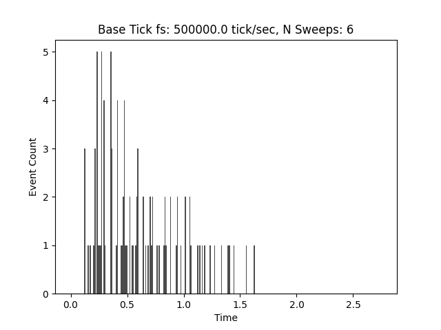

# Spike2 .srf File Reader

A lightweight Python reader for Spike2v10 `.srf` PSTH files. **Assumes 32-bit encoding and 50khz max tick fs.**

Return format `Dict[str, float | int], List[Tuple[float, List[float]]]`:
```python
{
    "N Bins Per Sweep" : int,
    "Bin Size (sec)" : float,
    "Offset (sec)" : float, 
    "Base Tick dt (sec)" : float
}
[
    (sweep1_start_time, [sweep1_event_time_1, sweep1_event_time_2, ...]),
    (sweep2_start_time, [sweep2_event_time_1, sweep2_event_time_2, ...]),
    ...
    (sweepN_start_time, [sweepN_event_time_1, sweepN_event_time_2, ...])
]
```
where `trial_start_time` is the time of sweep triggers (e.g. stimulus onset)
and `sweepN_event_time_M` is the time of the Mth event in the Nth sweep (e.g. neuron APs)

## Installation

No dependencies beyond the Python standard library (and `matplotlib` for `example.py`).

## Usage

```python
from srf_reader import read_srf_psth
from example.example import plot_srf_contents

file_metadata: Dict[str, float | int]
srf_contents: List[Tuple[float, List[float]]] 
file_metadata, srf_contents = read_srf_psth("./example/example.srf")
plot_srf_contents(file_metadata, srf_contents)
```

